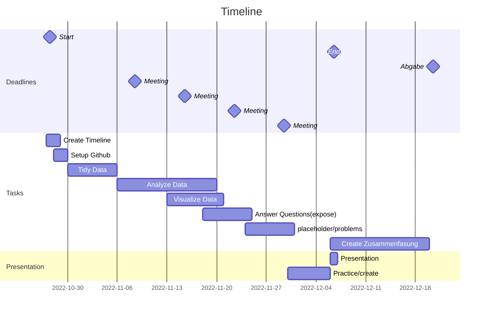

# ws22 Anfängerpraktikum

## Group meeting
 	weekly Thursday 10:00

---

Github: https://github.com/czycs/ws22airbnb

---
## Software

R 
github/gitlab 
(hackmd) 
overleaf 

### Namenskonvention
YYYY-MM-DD_"aussagekräftiger Name"

---
## Tasks
- [ ] Create Timeline
- [ ] Contact Project Partner
- [ ] read data
- [ ] Tidy Data und Plausibilitätskontrollen
- [ ] Analyze Data
- [ ] (Wie) Unterscheiden sich die beiden Städte im Bezug auf die angebotenen Objekte?
- [ ] Wie wichtig sind Lage, Ausstattung und Reviews/Hosteigenschaften jeweils in den beiden Städten für den Mietpreis?
- [ ] Sind die Zusammenhänge zwischen diesen Variablen in beiden Städten ähnlich stark bzw. ähnlich strukturiert?
- [ ] create the presentation
- [ ] create summary

#
